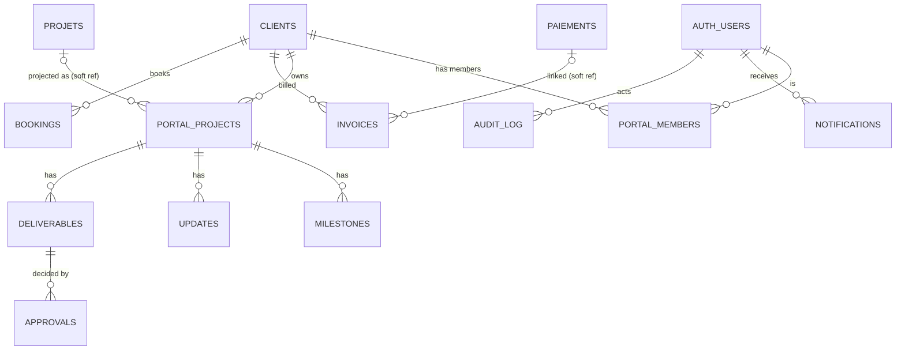

# Client Portal — Data Model

*Draft DDL is documentation of intent — reviewed, then executed in the implementation sprint (never before approval).*

## 1. Entity-relationship diagram



`CLIENTS`, `PROJETS`, `PAIEMENTS` are the existing Gestion tables — **untouched**, studio-only RLS. All `PORTAL_*` tables are new. Soft references (nullable FK, `on delete set null`) so Gestion's lifecycle never breaks the portal.

## 2. Tables (draft DDL)

```sql
-- membership: the authorization pivot
create table portal_members (
  id          uuid primary key default gen_random_uuid(),
  user_id     uuid not null references auth.users(id) on delete cascade,
  client_id   uuid not null references public.clients(id) on delete cascade,
  role        text not null check (role in ('studio','client_owner','client_member')),
  status      text not null default 'invited' check (status in ('invited','active','revoked')),
  invited_by  uuid references auth.users(id),
  notification_prefs jsonb not null default '{}',
  created_at  timestamptz not null default now(),
  unique (user_id, client_id)
);

-- published projection of a Gestion project
create table portal_projects (
  id          uuid primary key default gen_random_uuid(),
  client_id   uuid not null references public.clients(id) on delete cascade,
  projet_id   uuid references public.projets(id) on delete set null,   -- soft link to Gestion
  name        text not null,
  summary     text,
  status      text not null default 'active' check (status in ('active','paused','done')),
  progress    int  not null default 0 check (progress between 0 and 100), -- set at publish time
  starts_at   date, due_at date,
  published   boolean not null default false,
  created_at  timestamptz not null default now(),
  updated_at  timestamptz not null default now(),
  deleted_at  timestamptz
);

create table milestones (
  id          uuid primary key default gen_random_uuid(),
  portal_project_id uuid not null references portal_projects(id) on delete cascade,
  title       text not null,
  due_at      date,
  status      text not null default 'todo' check (status in ('todo','doing','done')),
  sort        int  not null default 0,
  created_at  timestamptz not null default now(),
  updated_at  timestamptz not null default now(),
  deleted_at  timestamptz
);

create table updates (
  id          uuid primary key default gen_random_uuid(),
  portal_project_id uuid not null references portal_projects(id) on delete cascade,
  title       text not null,
  body_md     text not null,
  author_id   uuid not null references auth.users(id),
  published_at timestamptz,                       -- null = draft, invisible to clients
  created_at  timestamptz not null default now(),
  deleted_at  timestamptz
);

create table deliverables (
  id          uuid primary key default gen_random_uuid(),
  portal_project_id uuid not null references portal_projects(id) on delete cascade,
  title       text not null,
  version     text not null default 'v1',
  file_path   text not null,                      -- storage: deliverables/{client_id}/{id}/{filename}
  preview_path text,                              -- optional image preview
  size_bytes  bigint,
  mime        text,
  status      text not null default 'draft'
              check (status in ('draft','shared','approved','changes_requested')),
  approval_required boolean not null default true,
  shared_at   timestamptz,
  created_at  timestamptz not null default now(),
  updated_at  timestamptz not null default now(),
  deleted_at  timestamptz
);

-- append-only decision trail
create table approvals (
  id          uuid primary key default gen_random_uuid(),
  deliverable_id uuid not null references deliverables(id) on delete cascade,
  decided_by  uuid not null references auth.users(id),
  decision    text not null check (decision in ('approved','changes_requested')),
  note        text,
  decided_at  timestamptz not null default now()
);

create table invoices (
  id          uuid primary key default gen_random_uuid(),
  client_id   uuid not null references public.clients(id) on delete cascade,
  paiement_id uuid references public.paiements(id) on delete set null,  -- soft link to Gestion
  number      text not null unique,               -- e.g. THEY-2026-014
  issued_at   date not null,
  due_at      date,
  amount_cents bigint not null,
  currency    text not null default 'MAD',
  status      text not null default 'sent' check (status in ('draft','sent','paid','overdue','void')),
  pdf_path    text,                               -- storage: invoices/{client_id}/{number}.pdf
  created_at  timestamptz not null default now(),
  updated_at  timestamptz not null default now(),
  deleted_at  timestamptz
);

create table bookings (
  id          uuid primary key default gen_random_uuid(),
  client_id   uuid not null references public.clients(id) on delete cascade,
  booked_by   uuid references auth.users(id),
  calendly_event_uri text unique,                 -- provider id (provider-agnostic column name ok)
  title       text, starts_at timestamptz, ends_at timestamptz,
  status      text not null default 'confirmed' check (status in ('confirmed','canceled','completed')),
  created_at  timestamptz not null default now()
);

create table notifications (
  id          uuid primary key default gen_random_uuid(),
  user_id     uuid not null references auth.users(id) on delete cascade,
  type        text not null,                      -- update_published | deliverable_shared | ...
  payload     jsonb not null default '{}',        -- {project_id, title, url…}
  created_at  timestamptz not null default now(),
  read_at     timestamptz,
  emailed_at  timestamptz
);

create table audit_log (
  id          bigint generated always as identity primary key,
  actor       uuid references auth.users(id),
  action      text not null,                      -- publish_project | share_deliverable | approve | ...
  entity      text not null, entity_id uuid,
  meta        jsonb not null default '{}',
  at          timestamptz not null default now()
);
```

Indexes: every `client_id`, `portal_project_id`, `user_id` FK; `notifications (user_id, read_at)`; `deliverables (portal_project_id, status)`; `invoices (client_id, status)`.

## 3. Storage layout (private buckets)

```
deliverables/{client_id}/{deliverable_id}/{filename}
invoices/{client_id}/{number}.pdf
previews/{client_id}/{deliverable_id}.jpg
```
Access only via signed URLs minted by RPCs that re-check membership (see API contracts §3). Bucket-level policies deny all direct reads.

## 4. Derived views (client-safe surface)

```sql
-- the only project surface clients can select from
create view v_client_projects with (security_invoker = true) as
  select id, client_id, name, summary, status, progress, starts_at, due_at, updated_at
  from portal_projects
  where published and deleted_at is null;
```
Similar `v_client_deliverables` (status <> 'draft'), `v_client_updates` (`published_at is not null`). RLS applies through `security_invoker`.

## 5. Migration & lifecycle notes

- All DDL ships as `supabase/migrations/00X_portal_*.sql` in the portal repo — idempotent, additive; **no changes to Gestion tables**.
- Soft-delete (`deleted_at`) everywhere clients read, matching SyncEngine conventions; hard deletes only via studio maintenance scripts.
- `updated_at` maintained by a single trigger function reused across tables.
- SaaS seam: a future `studio_id uuid` column on every table above, defaulting to the current studio — additive migration, RLS predicates widen from membership to (membership AND studio).
