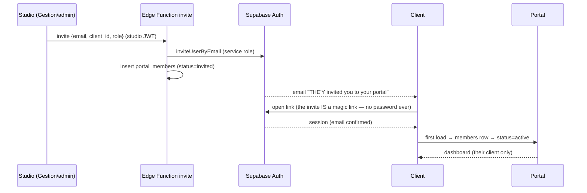
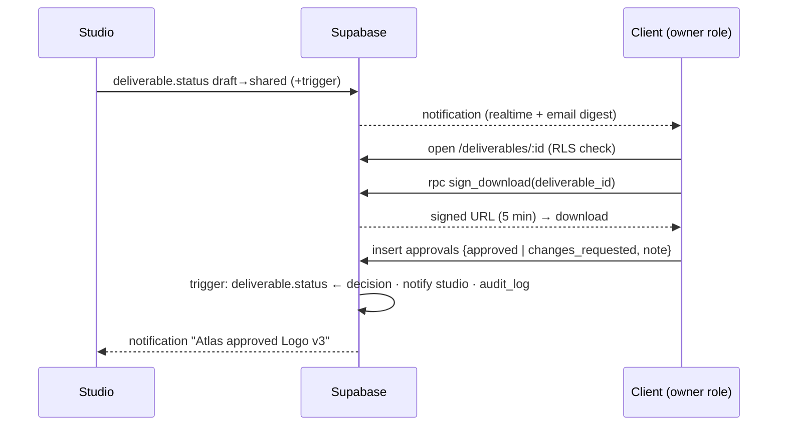
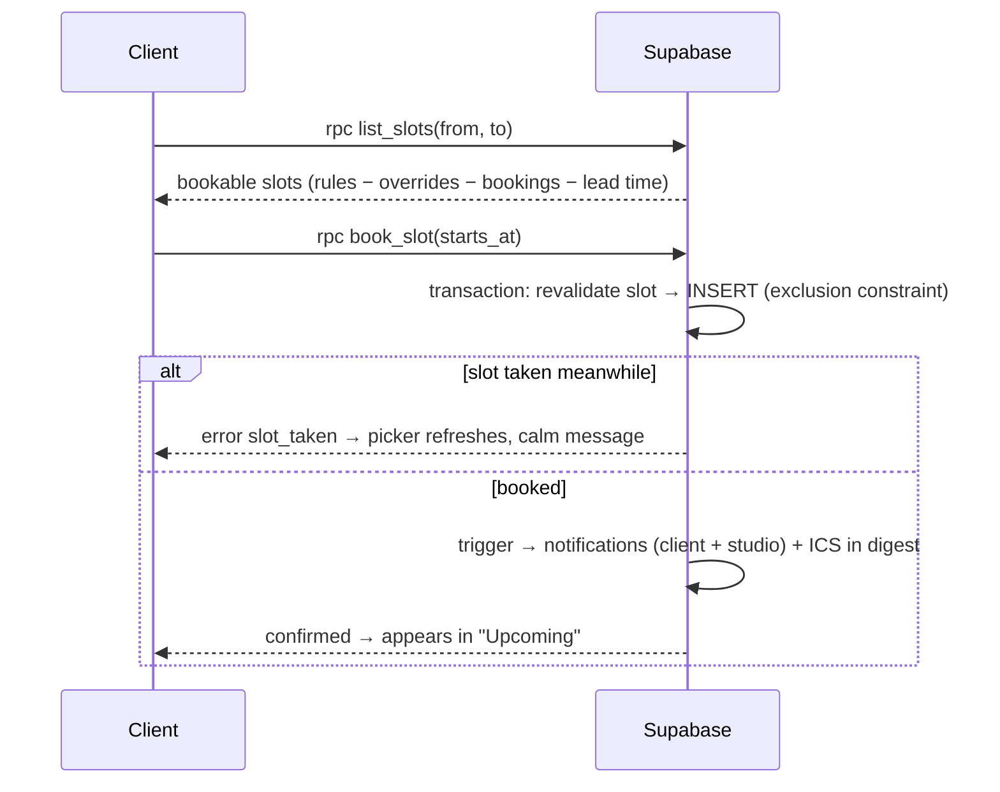

# Client Portal — User Flows

## 1. Invitation → first login

Edge cases: link expired → request a fresh magic link from `/login`; email already registered → normal magic-link login, membership attaches; revoked member → RLS returns nothing + "access ended" screen. **There is no password anywhere in v1.**

## 2. Track progress (the daily loop)

Login → **Dashboard**: one card per project — name, thin progress meter, next milestone, latest note snippet, unread dot. → **Project page**: milestone timeline (done/doing/todo), notes feed (markdown), deliverables strip. Reading a note marks its notification read.

## 3. Deliverable share → download → approve

Rules: only `client_owner` sees the approve bar; `changes_requested` requires a note; decisions are append-only (re-share creates version v2 → new decision).

## 4. Invoices

Dashboard badge "1 invoice due" → `/invoices`: list rows (number · issued · due · amount · status pill) → detail: line summary + **Download PDF** (signed URL) → status updates arrive from studio (`sent → paid` set in Gestion/admin, mirrored to `invoices`). Overdue = computed style, never a client-side mutation.

## 5. Book a meeting (native, provider-agnostic)

Cancel: client cancels ≥24h ahead (`status='canceled'`, frees the range); later = "contact the studio" (policy, not code). Reschedule = cancel + rebook. Calendly (or any provider) can join later as an adapter writing the same table — the flow above never changes for the client.

## 6. Notifications

Bell badge (realtime count) → panel: grouped by project, newest first → click = deep link + mark read. Email digest (Edge cron, 15-min batch) for unread items, per-type opt-out in `/settings`.

## 7. Studio flows (v1 admin surface)

Publish project (pick Gestion projet → name/summary/progress → publish) · post note (markdown, publish now/draft) · share deliverable or file (upload → kind → share) · edit availability (weekly windows + exceptions) · issue invoice (upload PDF + metadata, optionally link paiement) · invite/revoke member · "view as client" (read-only impersonation banner).

## 8. Error & empty states (first-class, per design language)

Empty dashboard: "Your first project appears here the day we press publish." · no slots this week → next available week auto-proposed · signed URL expired → one-click refresh · offline → calm banner, retry on focus · revoked → farewell screen with studio contact.
